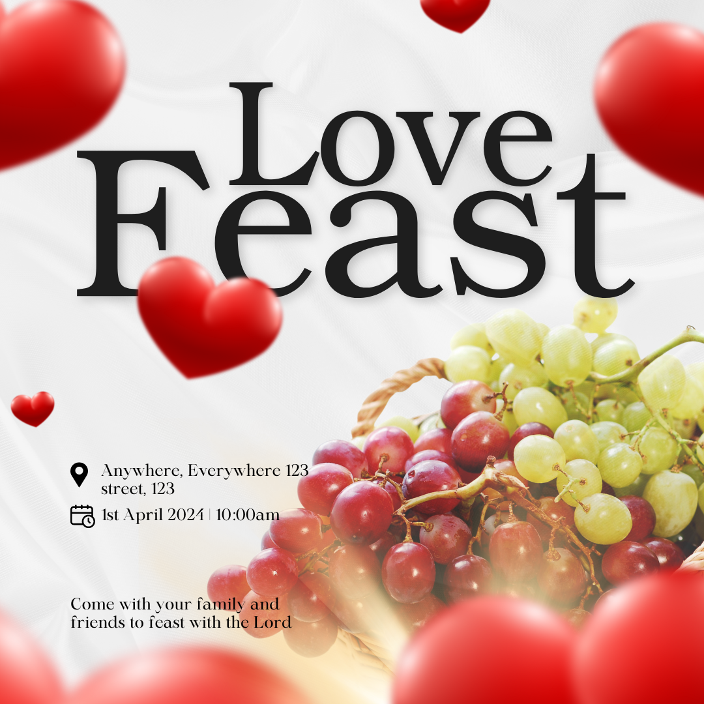
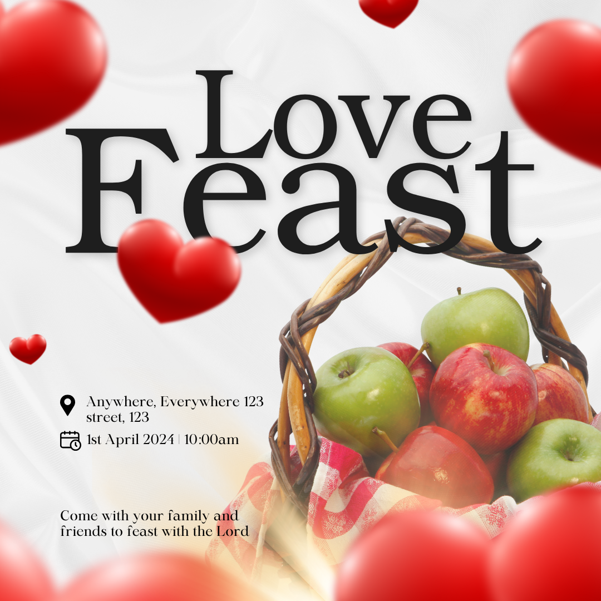

# Love-Feast-Social-Media-Post-Design
The Love Feast social media post design is crafted to capture the warmth and sense of community associated with the event. Here’s a detailed breakdown of the design elements:
Case Study: Love Feast Social Media Post Design

# Client Overview:
The client, a community organization, approached me to create a social media post design for their upcoming "Love Feast" event. The goal was to design a post that would resonate with the community, encourage participation, and effectively convey the warmth and spirit of the event.

# Project Objectives:

- To create a visually appealing design that reflects the themes of love, togetherness, and celebration.
- To ensure the design is optimized for social media platforms, maintaining impact and readability across various devices.
- To deliver a clear and compelling message that encourages engagement and participation.
Design Approach:
- The design process began with a deep understanding of the event's theme—Love Feast, which is centered around community, sharing, and warmth. I focused on creating a design that would not only attract attention but also evoke the desired emotions associated with the event.

:-----------------------------------:|:------------------------:
                           |    

Detailed Design Report: Love Feast Social Media Post

The Love Feast social media post design is crafted to capture the warmth and sense of community associated with the event. Here’s a detailed breakdown of the design elements:

Color Palette:
The primary colors used are soft reds, pinks, and golds, chosen to evoke feelings of love, warmth, and celebration. These colors are complemented by neutral tones to maintain a sophisticated and inviting look. The reds and pinks symbolize love and togetherness, while the gold adds a touch of elegance and festivity.

Layout:
The layout is designed to be clean and visually appealing, with a clear hierarchy that guides the viewer’s eye through the post. The event title, “Love Feast,” is prominently placed at the top in a bold, elegant font to ensure it grabs attention immediately. Below the title, the event details, including the date and time, are displayed in a slightly smaller yet still easily readable font.

Imagery:
High-resolution images of people sharing meals and enjoying each other’s company are used as the central visual elements. These images are carefully chosen to resonate with the theme of love and community. The images are framed with soft, rounded edges to create a warm and inviting feel. To enhance the design, I incorporated heart-shaped icons and subtle floral patterns, which reinforce the theme without overwhelming the overall composition.

Typography:
The fonts selected are a mix of modern and script styles, combining readability with a touch of elegance. The script font used for the event name adds a personal and intimate feel, while the sans-serif font used for the details ensures clarity and legibility, even on smaller screens.

Call to Action:
A strong call to action is placed at the bottom of the post, encouraging viewers to participate or share the event. The CTA is highlighted with a contrasting color to make it stand out without clashing with the overall design.

Optimization:
The design is optimized for social media platforms, ensuring that it maintains its visual impact and readability across different devices and screen sizes. The layout is responsive, with key information and imagery placed strategically to avoid any cropping or distortion when viewed on mobile devices.

Final Delivery:
The final design files have been delivered in multiple formats (JPEG, PNG) to accommodate various posting requirements. The design has been tested for color accuracy and resolution across different devices to ensure consistent quality.

Conclusion:
This design effectively communicates the essence of the Love Feast, using visual elements to create an engaging and inviting post. The balance of color, imagery, and typography is aimed at maximizing viewer engagement and ensuring the message is clear and impactful.
